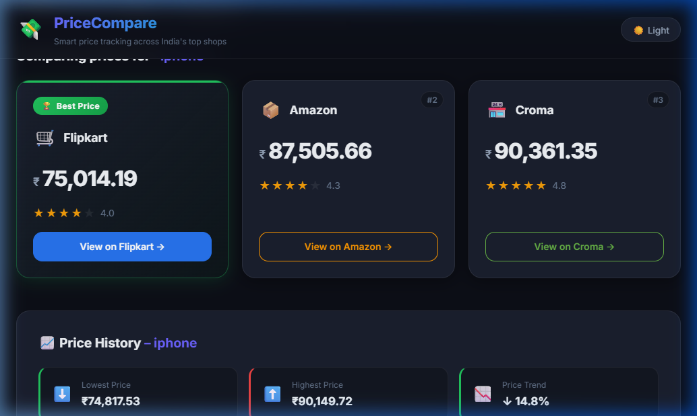

# 🛒 PriceCompare — Multi-Platform Price Comparison Web App

A full-stack web application that compares product prices across multiple e-commerce platforms with real-time price history tracking.

Built using **React (Vite)** and **FastAPI**, this project aggregates product data, provides robust data visualization, and helps users find the best deal instantly.

---

## 📸 Visual Demo



*The application automatically highlights the cheapest option (e.g., Flipkart) and visualizes price trends using interactive charts.*

---

## 🚀 Live Demo

Frontend: _(Add Vercel link)_  
Backend API: _(Add Render link)_

---

## 🎯 Features

- 🔍 **Search & Aggregation:** Search products across platforms (Amazon, Flipkart, Croma) simultaneously.
- 🏆 **Cheapest Option Highlight:** Automatically sorts and highlights the best price dynamically.
- 📈 **Price History Tracking:** Automatically logs queries to an SQLite database (`pricecompare.db`), providing real-time history tracking.
- 📊 **Data Visualization:** Interactive price-trend chart (Recharts) with Lowest/Highest stats and trend percentage.
- 🎨 **Modern & Responsive UI:** Glassmorphism design, CSS micro-animations, and a built-in Dark/Light mode toggle.
- ⚡ **FastAPI Backend:** Fast, modular, and asynchronous Python backend architecture.

---

## 🏗 Architecture

```
User → React Frontend → FastAPI Backend → Simulated Scrapers → Aggregated Results
                                      ↓
                               SQLite Database (History)
```

---

## 🛠 Tech Stack

### Frontend
- React (Vite)
- Axios & Recharts
- Vanilla CSS (CSS Variables, Flexbox/Grid)

### Backend
- FastAPI
- Python & Uvicorn
- SQLite3 (database.py)
- Pydantic

---

## 📂 Project Structure

```
PriceCompare/
│── backend/
│   │── main.py            # FastAPI entry point
│   │── database.py        # SQLite initialization and logic
│   │── models.py          # Pydantic schemas
│   │── scrapers.py        # Simulated marketplaces
│   │── aggregator.py      # Ranking & cheapest calculation
│   │── requirements.txt
│
│── frontend/
│   │── src/
│   │   │── components/    # SearchBar, ProductCard, PriceHistoryChart, LoadingSpinner
│   │   │── services/      # Axios API (api.js)
│   │   │── App.jsx & index.css
│   │── package.json
│   │── vite.config.js
│
│── docs/
│   │── screenshot.png
│── README.md
```

---

## ⚙️ Setup Instructions

### 🔹 Backend Setup

```bash
cd backend
pip install -r requirements.txt
python -m uvicorn main:app --reload --port 8000
```

Backend runs on: `http://localhost:8000` (Swagger docs at `/docs`)

---

### 🔹 Frontend Setup

```bash
cd frontend
npm install
npm run dev
```

*Note: If your system `npm` is corrupted, you can bypass it by using a standalone local installer or yarn.*

Frontend runs on: `http://localhost:5173`

---

## 🔌 API Endpoints

### 1. `GET /search`

Fetch aggregated results and persist them to the history database.

```http
GET /search?query=iphone
```

**Response:**
```json
{
  "query": "iphone",
  "results": [
    {
      "platform": "Amazon",
      "price": 74999,
      "rating": 4.5,
      "link": "...",
      "is_cheapest": false
    }
  ],
  "cheapest": { /* The cheapest product object */ }
}
```

### 2. `GET /history`

Fetch aggregated daily price history for a given product search term.

```http
GET /history?product=iphone
```

**Response:**
```json
{
  "product": "iphone",
  "history": [
    { "date": "2023-10-25", "price": 81000.0, "platform": "Amazon" },
    { "date": "2023-10-25", "price": 79000.0, "platform": "Flipkart" }
  ],
  "lowest_price": 79000.0,
  "highest_price": 81000.0
}
```

---

## 💡 How It Works

1. User enters product name in the React UI.
2. React sends request to FastAPI `/search` endpoint.
3. Backend fetches simulated marketplace data.
4. Aggregator sorts by price and flags the cheapest item.
5. The `database.py` saves the search instance into the SQLite `products` table if it's not a duplicate.
6. The frontend fetches the updated records from `/history` and paints a Recharts graph.
7. User dynamically toggles Dark Mode or clicks external product links!

---

## 🚀 Future Improvements

- User accounts & Wishlist system
- Real-world production API integration
- Price drop email alerts
- ML-based price prediction forecasting

---

## ⚠ Disclaimer

This project currently uses accurately simulated dynamic scraping (with reproducible seeded hashing) for educational and demonstration purposes. Real-world applications should use official APIs and comply with platform Terms of Service.

---

## 👤 Author

Your Name  
Final Year Engineering Student  
Focused on Full Stack & AI Systems